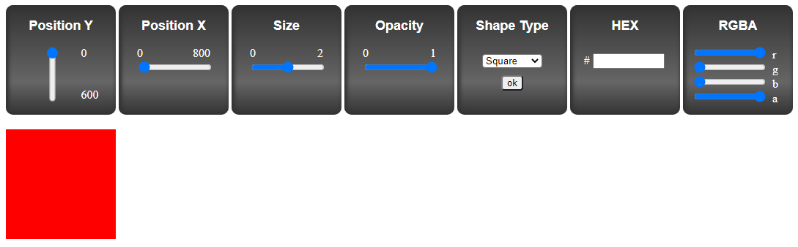

# Block Manipulation

> Block manipulation was a small javascript project as part of a course taught by Vertex Academy.

### Live Demo

[View this project on Netlify](https://lundeen-bryan-block-manipulation.netlify.app/)

---

### Table of Contents
The following information is available in this readme file.

- [Description](#description)
- [How To Use](#how-to-use)
- [References](#references)
- [License](#license)
- [Source Info](#source-info)

---

## Description

Small javascript demonstration to show the different ways to manipulate a block in javascript such as size, color, rotation, etc. Javascript simply changes the css. 

#### Technologies

- Javascript
- CSS3

[Back To The Top](#block-manipulation)

---

## How To Use

Each block in the top of the page is a control to move or change how the red block is displayed. 

#### Installation

Follow the link to the [Netlify url.](https://lundeen-bryan-block-manipulation.netlify.app/)

---

## References
[Back To The Top](#block-manipulation)

---

## License

MIT License

Copyright (c) [2020] [Bryan Lundeen]

Permission is hereby granted, free of charge, to any person obtaining a copy
of this software and associated documentation files (the "Software"), to deal
in the Software without restriction, including without limitation the rights
to use, copy, modify, merge, publish, distribute, sublicense, and/or sell
copies of the Software, and to permit persons to whom the Software is
furnished to do so, subject to the following conditions:

The above copyright notice and this permission notice shall be included in all
copies or substantial portions of the Software.

THE SOFTWARE IS PROVIDED "AS IS", WITHOUT WARRANTY OF ANY KIND, EXPRESS OR
IMPLIED, INCLUDING BUT NOT LIMITED TO THE WARRANTIES OF MERCHANTABILITY,
FITNESS FOR A PARTICULAR PURPOSE AND NONINFRINGEMENT. IN NO EVENT SHALL THE
AUTHORS OR COPYRIGHT HOLDERS BE LIABLE FOR ANY CLAIM, DAMAGES OR OTHER
LIABILITY, WHETHER IN AN ACTION OF CONTRACT, TORT OR OTHERWISE, ARISING FROM,
OUT OF OR IN CONNECTION WITH THE SOFTWARE OR THE USE OR OTHER DEALINGS IN THE
SOFTWARE.

[Back To The Top](#block-manipulation)

---

## Source Info

- Course on Udemy - [The Result-Oriented Web Developer Course - BOOTCAMP 2020 (Section 14)](https://www.udemy.com/course/result-oriented-web-developer-course/)

[Back To The Top](#block-manipulation)
